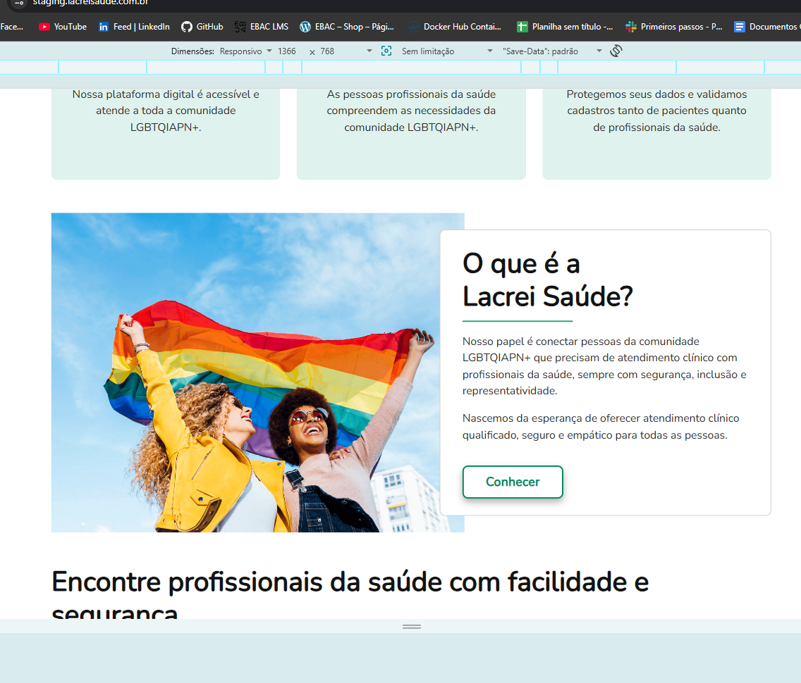
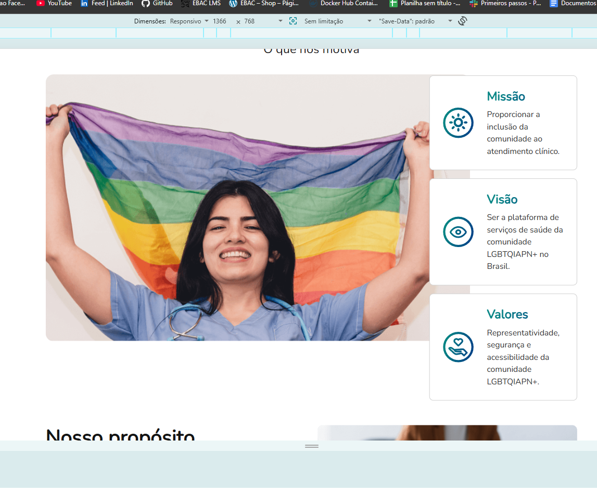

# BUG - Sobreposição de texto e imagem em resolução desktop

## ID
BUG-004

## Título
Texto das seções institucionais sobrepõe imagens em resolução desktop.

## Ambiente
- Navegador: Google Chrome
- Resolução: 1366x768
- Ambiente: Lacrei Saúde (Staging)

## Passos para reproduzir

1. Acessar a página inicial da Lacrei Saúde.
2. Abrir a aplicação em resolução desktop (1366x768).
3. Navegar até as seções:
   - O que é a Lacrei Saúde
   - Missão, Visão e Valores

## Resultado esperado

O texto e as imagens devem permanecer organizados, sem sobreposição, garantindo boa legibilidade e experiência do usuário.

## Resultado atual

Foi identificada uma leve sobreposição do texto com as imagens em duas seções da página inicial:

- "O que é a Lacrei Saúde"
- "Missão, Visão e Valores"

## Impacto

A sobreposição pode prejudicar a leitura do conteúdo e afetar a experiência do usuário em telas desktop.

## Evidências

### Seção "O que é a Lacrei Saúde"

### Seção "Missão, Visão e Valores"

